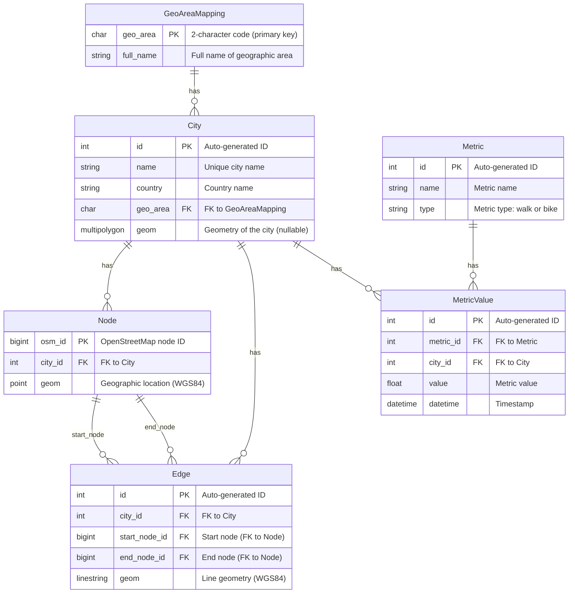

# City Network Analysis
This is the repository for the projects of the Geoinformatics Project course held in 2025 at Polimi.

**Supervisors**: Juan Pablo Duque, Maria Brovelli

## Project Overview
This project analyzes urban mobility using street network data from OpenStreetMap (OSM). The goal is to develop a backend system for storing and managing street networks and mobility metrics, allowing for comparative analysis of cities based on street characteristics.

The backend includes a database and API service to store, process, and manage street network data, compute mobility indicators, and provide data access.
## Project Structure
```text
city_network_analysis/
├── city_network_analysis/
│   ├── __init__.py
│   ├── settings.py
│   ├── urls.py
│   └── wsgi.py
└── streets/
    ├── migrations/
    ├── templates/
    │   ├── city_metrics.html
    │   └── db_map.html
    ├── __init__.py
    ├── admin.py
    ├── apps.py
    ├── models.py
    ├── views.py
    ├── utils.py
    ├── data.py
    └── tests.py
├── manage.py
├── Dockerfile
├── docker-compose.yml
├── README.md
├── Report.md
├── requirements.txt
└── Urban Metrics API.postman_collection.json

```

## Database

## API Design

This API provides endpoints for managing urban metrics data including cities, measurement metrics, network nodes, and edges.

**Base URL**: `http://localhost:8000/api/`

All responses are in JSON format.

## Postman Collection

A full Postman collection is provided for testing and reproducibility.

### Available Endpoints

#### City Endpoints
- `GET /api/cities/` - Get All Cities
- `GET /api/cities/?search={city_name}` - Get City by Name
- `POST /api/cities/` - Create City
- `POST /api/cities/bulk_create/` - Bulk Create City
- `PUT /api/cities/{id}` - Update City
- `DELETE /api/cities/{id}/` - Delete City
- `DELETE /api/cities/delete_graph/?city={city_name}` - Delete Graph
- `DELETE /api/cities/delete_metric_value/?city={city_name}` - Delete Delete Metric Value

#### Metric Endpoints
- `GET /api/metrics/` - Get All Metrics
- `GET /api/metrics/?search={name} {type}` - Get Metric by Name and Type
- `POST /api/metrics/` - Create Metric
- `POST /api/metrics/bulk_create/` - Bulk Create Metric
- `PUT /api/metrics/{id}/` - Update Metric
- `DELETE /api/metrics/{id}/` - Delete Metric

#### MetricValue Endpoints
- `GET /api/metricvalues/` - Get All Metric Values
- `GET GET /api/metric-values/?city_name={city_name}` - Get Filtered Metric Values
- `POST /api/metricvalues/` - Create MetricValue
- `POST /api/metric-values/bulk_create/` - Bulk Create MetricValue
- `PUT /api/metricvalues/{id}/` - Update MetricValue
- `DELETE /api/metricvalues/{id}/` - Delete MetricValue

#### Node Endpoints
- `GET /api/nodes/` - Get All Nodes
- `GET /api/nodes/city/{city_id}/` - Get Nodes by City
- `GET /geojson/nodes/?city={city_name}` - Get Nodes as GeoJSON
- `POST /api/nodes/` - Create Node
- `POST /api/nodes/bulk_create/` - Bulk Create Node
- `PUT /api/nodes/{id}/` - Update Node
- `DELETE /api/nodes/{id}/` - Delete Node

#### Edge Endpoints
- `GET /api/edges/` - Get All Edges
- `GET /api/edges/city/{city_id}/` - Get Edges by City
- `GET /geojson/edges/?city={city_name}` - Get Edges as GeoJSON
- `POST /api/edges/` - Create Edge
- `POST /api/edges/bulk_create/` - Bulk Create Edge
- `PUT /api/edges/{id}/` - Update Edge
- `DELETE /api/edges/{id}/` - Delete Edge

**Access the collection**:  
- [Postman Collection Link](https://xiaotan-6436217.postman.co/workspace/xiao-tan's-Workspace~73cb4ce1-4af2-4705-896a-9af5177494b9/collection/44577322-cd2a15fa-72f4-4adb-96b3-b6583872cb4c?action=share&creator=44577322)  
- You can also import the `Urban Metrics API.postman_collection.json` file provided in the repository directly into Postman.  
- You can view the complete documentation for the Urban Metrics API collection, including detailed descriptions, constraints,and examples, in the Urban Metrics API collection folder> ["Complete Documentation"](https://xiaotan-6436217.postman.co/workspace/73cb4ce1-4af2-4705-896a-9af5177494b9/documentation/44577322-cd2a15fa-72f4-4adb-96b3-b6583872cb4c) section.

## Setup and Installation

### Prerequisites

To run this project, you need to have Docker and Docker Compose installed on your machine.

- [Install Docker](https://www.docker.com/get-started)
- [Install Docker Compose](https://docs.docker.com/compose/install/)

### 1. Clone the Repository

Clone this project to your local machine:
```bash
git clone https://github.com/tanxiaoo/city_network_analysis.git
cd city_network_analysis
```

### 2. Modify the Settings File

Before building and starting the services, open the `city_network_analysis/settings.py` file and comment out the following two lines of code(if they exist):

```python
GDAL_LIBRARY_PATH = (r"D:\06_Polimi\2024-2025\02_Semester4\Project\city_network_analysis\.venv\Lib\site-packages\osgeo"
                     r"\gdal.dll")

os.environ['GDAL_LIBRARY_PATH'] = GDAL_LIBRARY_PATH
```

### 3. Build and Start the Services

Run the following command to build the Docker images and start the services:
```bash
docker-compose up --build
```

This command will:
- Build the Docker images (including Python, Django, and dependencies)
- Start the web service (Django) and database (PostgreSQL)
- Make the project accessible at http://localhost:8000

The database will be automatically initialized during the first startup.


### 4. Running the Project

After the initial setup, you can start the project anytime with:
```bash
docker-compose up
```

The web application will be available at http://localhost:8000.