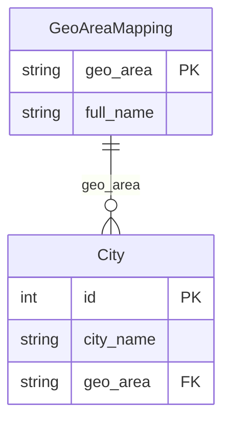

# City Network Analysis

This is the repository for the projects of the Geoinformatics Project course held in 2025 at Polimi.

**Supervisors**: Juan Pablo Duque, Maria Brovelli

## Project Overview

This project aims to develop an automated pipeline to extract urban street network data from OpenStreetMap (OSM), compute network-based walkability and bikeability indicators, and build a WebGIS system to enable users to compare and match similar cities based on street network features.

The project methodology is inspired by recent research utilizing multimodal and multiscale street network representations.

## Data Sources

- **OpenStreetMap (OSM)**: Global open-source street network data.
- **NASADEM**: Global digital elevation model (30m resolution) for obtaining node elevation.
- **GHS Urban Centre Database (GHS-UCDB R2024A)**: Provides city boundaries and built-up areas.

## Project Structure
```text
city_network_analysis/
├── manage.py
├── city_network_analysis/
│   ├── __init__.py
│   ├── settings.py
│   ├── urls.py
│   └── wsgi.py
└── streets/
    ├── migrations/
    ├── templates/
    │   ├── city_metrics.html
    │   └── db_map.html
    ├── __init__.py
    ├── admin.py
    ├── apps.py
    ├── models.py
    ├── views.py
    ├── utils.py
    ├── data.py
    └── tests.py
```
## Workflow
### Data Extraction
- Download city street networks (driving, walking, cycling) using OSMnx.
- Download NASADEM data
- Download city boundaries and built-up areas data from GHS Urban Centre Database

### Data Preprocessing
- Filter redundant pedestrian paths and cycling lanes.
- Interpolate elevation data from NASADEM.
- Compute edge slope and orientation attributes.

### Metric Calculation
- Calculate approximately 11 network indicators (e.g., average circuity, orientation entropy, road density, average steepness, intersection density).

### Database Storage
- Store cities, street networks, and calculated metrics in a PostgreSQL + PostGIS database.

### WebGIS Development
- Interactive visualization using Leaflet.
- Backend API to query metrics and find similar cities.


