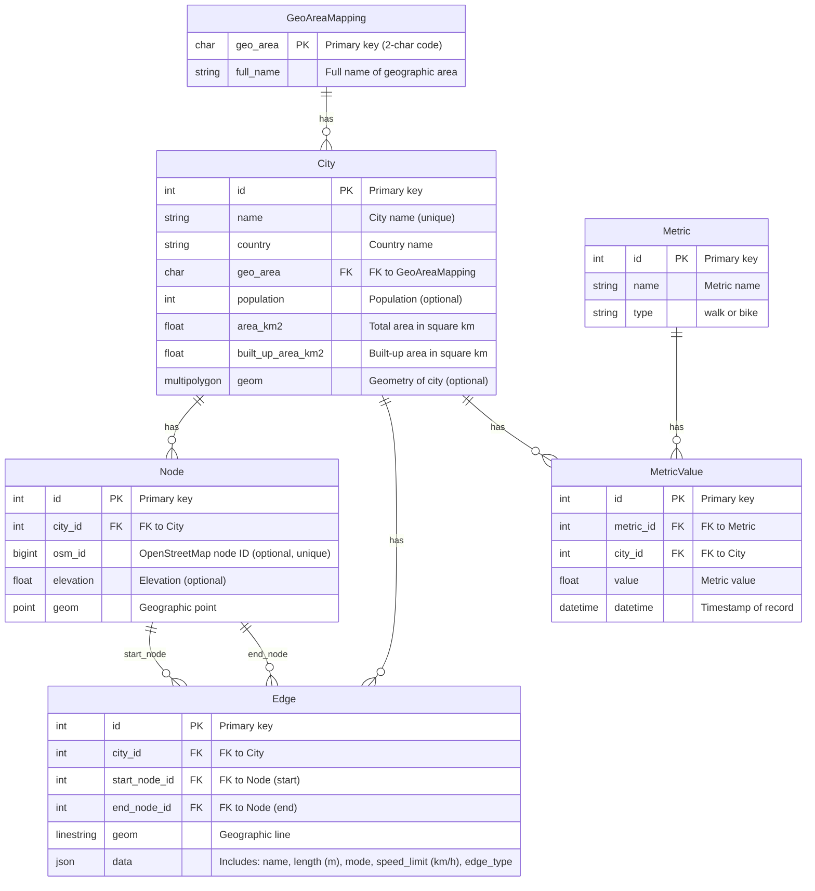

# Urban Mobility Metrics Backend System Documentation

## 1. Project Background

Urban mobility is determined by the structure of the street network, directly influencing residents' travel modes, traffic efficiency, and spatial urban organization. Analyzing urban street networks is essential for improving transportation systems and supporting urban planning.

This project, based on OpenStreetMap (OSM) street network data, develops a backend system to store and manage urban street graphs and mobility metrics, enabling comparative analysis between cities based on street network characteristics.

## 2. System Description

The backend system consists of a database and a web service, aimed at storing, processing, and managing urban street network data, while also computing mobility indicators and providing data access through APIs.

### Main Features

- **Data Preparation & Processing**: Receives and processes street network data, converts formats, simplifies graphs, and stores results in the database.
- **Data Storage & Management**: A well-designed database structure stores city metadata, computed mobility indicators, and simplified street networks, supporting visualization and analysis.
- **API Endpoints**: Provides CRUD operations for cities, street networks, and metric data. Also supports GeoJSON downloads for integration with frontend and WebGIS applications.
- **Automated Pipeline**: Automatically extracts and processes OSM data, computes mobility metrics, and shares results via web services for comparative analysis.

The system ensures a standardized workflow and reusable interface services, providing a stable data platform for urban mobility studies.

## 3. Technology Stack

The backend is developed using the Django framework, with PostGIS for spatial data storage and management, and a set of spatial and graph analysis libraries for metric computation.

### Backend Technologies

- **Django 5.1.7** – Web backend and REST API framework  
- **GeoDjango** – Spatial extension for Django ORM  
- **PostgreSQL 12.x + PostGIS** – Spatial database for geometry data  
- **GDAL 3.8.4** – Geospatial data format support  
- **psycopg2 2.9.10** – PostgreSQL adapter for Python  

### Spatial & Network Analysis Libraries

- **OSMnx 2.0.2** – Extract and simplify OSM street networks  
- **NetworkX 3.4.2** – Graph structure and topological analysis  
- **GeoPandas 1.0.1** – Geospatial operations on tabular data  
- **Shapely 2.0.7** – Geometry construction and spatial computation  
- **pyproj 3.7.1** – Coordinate reference system transformations  

## 4. Database Design

### 4.1 Architecture

The system uses PostgreSQL with PostGIS extension to manage spatial data, with the following core tables:
- **GeoAreaMapping** - Geographic region classification
- **City** - Urban settlement metadata
- **Metric** - Mobility metric definitions  
- **MetricValue** - Computed metric results
- **Node** - Street network intersections
- **Edge** - Connections between nodes

### 4.2 Data Models

#### GeoAreaMapping
Stores geographic region classifications.

| Field       | Type         | Description               |
|-------------|--------------|---------------------------|
| `geo_area`  | CharField (PK)| 2-letter region code (e.g. "EU") |
| `full_name` | CharField    | Full region name          |

#### City
Contains urban settlement metadata with spatial boundaries.

| Field               | Type               | Description                     |
|---------------------|--------------------|---------------------------------|
| `name`             | CharField (Unique) | City name                      |
| `country`          | CharField          | Country name                   |
| `geo_area`         | ForeignKey         | Links to GeoAreaMapping        |
| `population`       | PositiveIntegerField | Optional population count     |
| `area_km2`         | FloatField         | Total administrative area      |
| `built_up_area_km2`| FloatField         | Urbanized land area           |
| `geom`             | MultiPolygonField  | City boundary geometry (SRID 4326) |

#### Metric
Defines mobility metric types and categories.

| Field    | Type              | Description                     |
|----------|-------------------|---------------------------------|
| `name`   | CharField         | Metric identifier (e.g. "CIR") |
| `type`   | CharField         | Category: `walk` (Walkability) or `bike` (Bikeability) |

**Constraints**:
- Unique combination of `name` and `type`

#### MetricValue
Stores computed metric results for cities.

| Field       | Type          | Description                     |
|-------------|---------------|---------------------------------|
| `metric`    | ForeignKey    | Links to Metric                |
| `city`      | ForeignKey    | Links to City                  |
| `value`     | FloatField    | Computed metric value          |
| `datetime`  | DateTimeField | Calculation timestamp          |

**Constraints**:
- Unique combination of `metric`, `city`, and `datetime`

#### Node
Represents street network intersections.

| Field       | Type          | Description                     |
|-------------|---------------|---------------------------------|
| `city`      | ForeignKey    | Parent city reference          |
| `osm_id`    | BigIntegerField | Optional OSM node ID           |
| `elevation` | FloatField    | Optional elevation (meters)    |
| `geom`      | PointField    | Spatial coordinates (SRID 4326, geography) |

#### Edge
Connects nodes with attributed street segments.

| Field         | Type          | Description                     |
|---------------|---------------|---------------------------------|
| `city`        | ForeignKey    | Parent city reference          |
| `start_node`  | ForeignKey    | Origin node (related_name: 'start_edges') |
| `end_node`    | ForeignKey    | Destination node (related_name: 'end_edges') |
| `geom`        | LineStringField | Street geometry (SRID 4326, geography) |
| `data`        | JSONField     | Road attributes:               |
|               |               | - `name`: Street name          |
|               |               | - `length`: Segment length (m) |
|               |               | - `mode`: Travel mode          |
|               |               | - `speed_limit`: km/h          |
|               |               | - `edge_type`: Road classification |

**Constraints**:
- Unique combination of `city`, `start_node`, and `end_node`
- Spatial index on `geom`
- `length`: must be a number (int or float), optional
- `speed_limit`: must be a number (int or float), optional
- `mode`: must be one of ['pedestrian', 'driving', 'cycling', 'public_transport'], optional
- `edge_type`: must be one of ['highway', 'urban', 'rural', 'alley'], optional

**Methods**:
- `set_data()`: Validates and stores edge attributes in JSON field

### 4.3 Entity Relationships
#### Key relationships:
- One GeoAreaMapping contains multiple City records
- One City contains multiple Node, Edge, and MetricValue records
- Each Edge connects exactly two Node records (directional)
- MetricValue joins City with Metric through time-series data


## 5. API Design

### API Overview

This API provides endpoints for managing urban metrics data including cities, measurement metrics, network nodes, and edges.

**Base URL**: `http://localhost:8000/api/`

All responses are in JSON format.

#### Key Features

- Manage city records
- Access and manage street networks (`Node`, `Edge`) with spatial queries and downloads
- Manage mobility metrics (`Metric`, `MetricValue`)
- Support filtered queries and categorized metric retrieval

### Example API Endpoints

#### POST /api/cities/
**URL**: `http://localhost:8000/api/cities/`  
Creates a new city entry in the database.

**Request Body**:
```json
{
    "name": "Berlin",
    "country": "Germany",
    "population": 3600000,
    "area_km2": 891.8,
    "built_up_area_km2": 310.4,
    "geom": null,
    "geo_area": "EU"
}
```
### GET /api/metric-values/
**URL**: `http://127.0.0.1:8000/api/metric-values/?city_name=Milan&start_date=2025-05-01&end_date=2025-05-12`  
Retrieves filtered list of metric values.

**Query Parameters**:
- `city_name`: Milan
- `metric_name`: CIR
- `metric_type`: walk
- `start_date`: 2025-05-01
- `end_date`: 2025-05-12

### GET /api/nodes/
**URL**: `http://127.0.0.1:8000/api/nodes/?city=1`  
Returns nodes filtered by city ID.

**Query Parameters**:
- `city`: 1

### GET /api/edges/
**URL**: `http://127.0.0.1:8000/api/edges/?city=1`  
Returns edges belonging to specified city.

**Query Parameters**:
- `city`: 1

**## Postman Collection

A full Postman collection is provided for testing and reproducibility.

### Available Endpoints

#### City Endpoints
- `GET /api/cities/` - Get All Cities
- `POST /api/cities/` - Create City
- `PUT /api/cities/{id}/` - Update City
- `DELETE /api/cities/{id}/` - Delete City

#### Metric Endpoints
- `GET /api/metrics/` - Get All Metrics
- `POST /api/metrics/` - Create Metric
- `PUT /api/metrics/{id}/` - Update Metric
- `DELETE /api/metrics/{id}/` - Delete Metric

#### MetricValue Endpoints
- `GET /api/metricvalues/` - Get All Metric Values
- `GET /api/metricvalues/filtered/` - Get Filtered Metric Values
- `POST /api/metricvalues/` - Create MetricValue
- `PUT /api/metricvalues/{id}/` - Update MetricValue
- `DELETE /api/metricvalues/{id}/` - Delete MetricValue

#### Node Endpoints
- `GET /api/nodes/` - Get All Nodes
- `GET /api/nodes/city/{city_id}/` - Get Nodes by City
- `POST /api/nodes/` - Create Node
- `PUT /api/nodes/{id}/` - Update Node
- `DELETE /api/nodes/{id}/` - Delete Node

#### Edge Endpoints
- `GET /api/edges/` - Get All Edges
- `GET /api/edges/city/{city_id}/` - Get Edges by City
- `POST /api/edges/` - Create Edge
- `PUT /api/edges/{id}/` - Update Edge
- `DELETE /api/edges/{id}/` - Delete Edge

**Access the collection**:  
- [Postman Collection Link](https://xiaotan-6436217.postman.co/workspace/xiao-tan's-Workspace~73cb4ce1-4af2-4705-896a-9af5177494b9/collection/44577322-cd2a15fa-72f4-4adb-96b3-b6583872cb4c?action=share&creator=44577322)
- You can also import the Urban Metrics API.postman_collection.json file provided in the repository directly into Postman.
